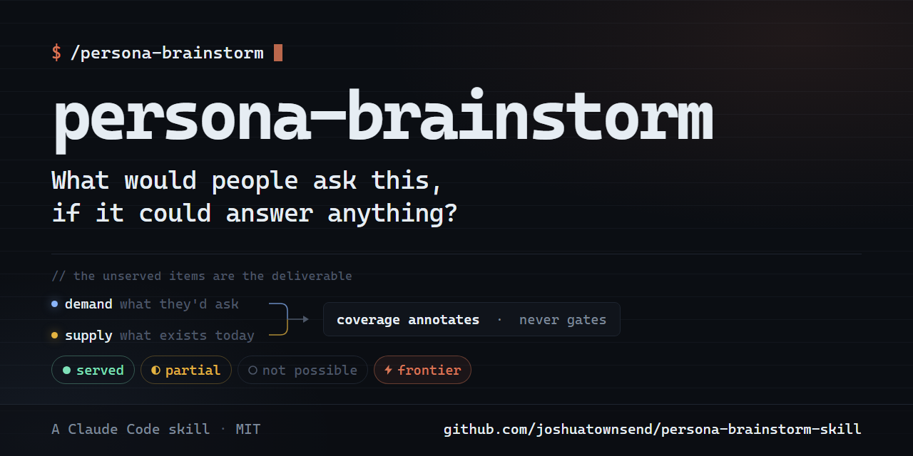

<p align="center">
  
</p>

# persona-brainstorm

**What would people ask this thing for, if it could answer anything?**

Every feature list is written in the builder's vocabulary and bounded by what already exists. That's what makes them comfortable to read and nearly useless for deciding what to build next — the ideas worth having are precisely the ones that got filtered out for being unimplementable.

`persona-brainstorm` is a [Claude Code](https://claude.com/claude-code) skill that runs the other direction. It derives the people who'd use your subject, captures what each of them would genuinely ask for in their own words — with the decision each answer feeds — and only *then* looks at what you actually ship. What's served today becomes a trailing annotation, never a filter. The gap between the two is the deliverable.

It runs against a repo, and it runs against things that have no repo at all: a product, an API, a dataset, a hiring process.

## The one hard rule

**Coverage annotates. Coverage never gates.**

An item earns its place by being something a real person would really ask — never by being implementable. This exists because it's the lesson that made the original run valuable: the first attempt filtered candidates through the shipped surface area and quietly deleted every idea with no current implementation, which was exactly the set worth having.

The phase order enforces the rule so you don't have to. All the imagining happens *before* any discovery of what exists, because an inventory read first is impossible to un-see and every item afterward bends toward it.

And when you already know the implementation — the usual case, since the most likely operator is whoever built the thing — the skill says so and gives you two honest options: derive the roster and the items in separate uncontaminated agents, or disclose the contamination at the top of the document. It won't let you claim the run was clean.

## Who this is for

**The team that keeps building the wrong quarter.** Your roadmap is a queue of things somebody asked for, and none of it feels like a product. This produces the other input: 40–80 asks in the users' own words, each tied to the decision it feeds, with the ratio of served-to-unserved as the finding. It's the document that tells you which whitespace is real.

**The maintainer who can't see their own library anymore.** You know it too well to imagine wanting anything it doesn't do. The skill's blind-generation path exists for exactly this — the roster and the items get derived by agents that have never seen your source, working only from the domain and the frame you set.

**Anyone about to write a PRD from vibes.** Personas here aren't demographics, they're people with jobs to do, and every one of them has to survive a distinctness test: cover the names, read only the asks, and if you can't tell two personas apart they were one persona wearing two job titles.

**Platform teams comparing across subjects.** Run it once per subject, then read the documents together. A capability demanded by several *unrelated* subjects is a platform primitive rather than N copies of a feature — and that's invisible from inside any single document. Stable slugs are the join key.

## How it works

```
Phase 0     Frame — the subject (never the repo), the scope constraint,
            the budget, the archetype, and a pre-registered prediction
Phase 1     Derive the personas, then stop — user approves the roster
Phase 2     The items — quoted asks, the decision each feeds, what they
            do instead today, frequency, and the frontier mark
Phase 3     Inventory what exists today  ← the first look at the artifact
Phase 4     Annotate coverage — trailing column, nothing reordered
Phase 5     Synthesis — cluster into capability primitives, rank three,
            reckon against the prediction
Phase 6     Assemble the document
Phase 7     Verify — a checker that counts, then a fresh adversarial read
```

**Phase 0 pre-registers what would count as being wrong.** You predict the coverage split before a single item exists, name the result that would make you doubt the *frame* rather than the subject, and set the rule for deleting an item before you're attached to any of them. Phase 5 has to reckon against that in writing, and the checker verifies both halves against the tables. A prediction made after seeing the result isn't one.

**Phase 2 reaches past the obvious.** The first fifteen items are the ones anyone could write; the value is in the back half. Each archetype carries its own reach-further axes — time and joins and entitlement for a read surface, version skew and error paths for a library, the exception nobody wrote down for a process — plus the two that pay off everywhere: what the rare high-stakes persona asks once a year, and the **frontier**, the class of ask that's obviously valuable, obviously hard, and that a cautious reader would delete first. If your list has no frontier items, you under-reached.

**Phase 5 marks its own evidence.** Every capability primitive is tagged `observed`, `inferred`, or `invented`, and the first two must name a source. `invented` isn't a lesser mark — the frontier is invented by construction, and a method that penalised the mark would stop producing the best findings. What gets checked is honesty, not kind.

**Phase 7 doesn't trust the author.** Every gate before it is advice addressed to the same model being graded. So a Python checker parses the finished tables and recomputes what the document actually contains — continuous numbering, per-persona counts against promised budgets, the frontier count, the coverage tally, whether a *Why* merely restates its *Ask*, whether primitives cite items that exist. It exists because a run of this skill once self-reported 21 frontier items for a document carrying 26, and nothing in the method caught it. The rule that makes the phase work: **you never count anything.**

## Usage

Invoke it by name, or just describe the goal — "who would use this and what would they want", "what are we missing", "what should this MCP server be able to answer":

```
/persona-brainstorm:persona-brainstorm   # installed as a plugin — Claude Code
                                         # namespaces a bundled skill by its plugin
/persona-brainstorm                      # copied into ~/.claude/skills/
```

Phase 0 asks you seven questions and won't guess at the answers. The two that matter most:

- **The subject is not the repo.** State it as a hypothetical generic capability over the domain — *"a generic read-only interface over the DNS/DHCP/IPAM estate"*, not *"our MCP server"*. Personas who use the first generate a rich, product-independent wish list; personas who use the second generate a bug list about your CLI.
- **The item budget is a lever, not a size.** 40–80 is healthy, 60 is a good default. Doubling it on a second pass isn't asking for padding — it's asking you to reach further.

Coverage runs at three depths: **Full** (verify against the evidence and cite it — the pass that finds real bugs), **Light** (best-effort from docs and manifests), or **None** (pure demand-side, the only option when there's nothing built to inspect).

## What you get

A single markdown document, `PERSONAS.md` by default:

```
PERSONAS.md
  the frame, the coverage key, and the pre-registration line
  the persona roster, with deliberately uneven item budgets
  the items — quoted ask · the decision it feeds · what they do today · frequency · ⚡ · coverage
  the tally, and the ratio named as the finding
  the capability primitives, each citing its items and marked observed / inferred / invented
  "if you only ask for three" — a forced ranking
  the reckoning against Phase 0's prediction
  Appendix A — what exists today, explicitly not bounding anything above
```

Run the checker against it at any time:

```sh
python <skill-dir>/scripts/verify.py PERSONAS.md --final
```

### Optionally, two more passes

Ask for an **enrichment pass** and every item expands into the situation that produced it, the pressure behind it, and what answering it takes — written to a sibling of the core document, with a topic axis that crosses the persona one. A shareable page is offered on top of that, once; decline it and the markdown is still written, which is the deliverable and the source of truth in either case.

The format carries its honesty mechanically rather than by disclaimer: the coverage mark *chooses* the heading. A served item gets "How it's answered today" in the present tense; an assessed-and-absent one gets "What would have to exist"; and a run with no coverage pass gets "What answering this would take", because nobody looked and unknown is not the same as unserved. None of the three is a judgment call, and a reader can tell them apart without trusting the author. A served item may only claim what the inventory actually recorded, and names the appendix lane that carries it. This matters because enrichment is where a demand-side document turns into a case study — sixty scenes of confident prose are far more persuasive than sixty table rows, and nothing in the prose reveals which of them were observed.

And an **adversarial pass** collects the other half of the picture: what each persona dislikes, distrusts, works around, or believes they should be able to do and can't. The wish frame has one blind spot — nobody phrases a grievance as a wish — so someone who stopped trusting a view after it misled them during an incident never turns up asking for a trustworthy view. They turn up asking for something else, or not at all.

The gate that keeps it from being the unserved list in a bad mood: every grievance must name the thing it's about, and that thing has to exist. Absence is already on the page; this pass is for what exists and disappoints. It needs a coverage pass to have run, because a persona can't resent a hypothetical.

This repo's own `PERSONAS.md` is a real run of the skill against itself — the worked output, not a template. `skills/persona-brainstorm/references/worked-example-ddi.md` walks through the DDI run the method was extracted from.

## Install

As a plugin (recommended):

```
/plugin marketplace add joshuatownsend/persona-brainstorm-skill
/plugin install persona-brainstorm@persona-brainstorm-marketplace
```

Or copy the skill directly:

```
git clone https://github.com/joshuatownsend/persona-brainstorm-skill
mkdir -p ~/.claude/skills
cp -r persona-brainstorm-skill/skills/persona-brainstorm ~/.claude/skills/
```

Requires Claude Code. Phase 7's checker needs Python 3.9+ (standard library only); nothing else has dependencies.

## Design principles

1. **Coverage annotates, it never gates** — the unserved items are the deliverable, and a document where everything is already covered has failed.
2. **Imagine before you inventory** — enforced by phase order, because knowing to distrust your own anchoring does not undo it.
3. **Say which numbers are measured** — frequencies, primitive evidence, and the coverage split all carry an explicit provenance mark. An unauditable claim of evidence is worse than an honest `invented`.
4. **Pre-register, then reckon** — predict the result before generating, report the gap in writing whether or not the news is good, and say plainly when a held prediction taught you nothing.
5. **Never grade your own homework** — Phase 7 is a checker that counts and a fresh agent that argues, because the model that under-reached is the model being asked to notice it under-reached.

## Provenance

Extracted from a real brainstorm over a DDI estate (DNS, DHCP, IPAM) reached through a generated CLI with an MCP server — a run whose Full coverage pass surfaced a security-relevant enforcement gap that no amount of doc-reading would have found. The method has since been run against its own repository, which is where `PERSONAS.md` came from and where several of its rules were found to be missing.

Built with Claude Code. Sibling skills: [ideate](https://github.com/joshuatownsend/ideate), [huh](https://github.com/joshuatownsend/huh-skill), [pr-resolve](https://github.com/joshuatownsend/pr-resolve-skill).

## Contributing

Issues and PRs welcome — especially from running this on your own subject. If the roster came out generic, the items read like a backlog, or the checker flagged something that wasn't wrong, that's the feedback that improves it. New archetype rows are particularly welcome: [`references/discovery.md`](skills/persona-brainstorm/references/discovery.md) documents the contract a new one has to satisfy.

## License

[MIT](LICENSE)
